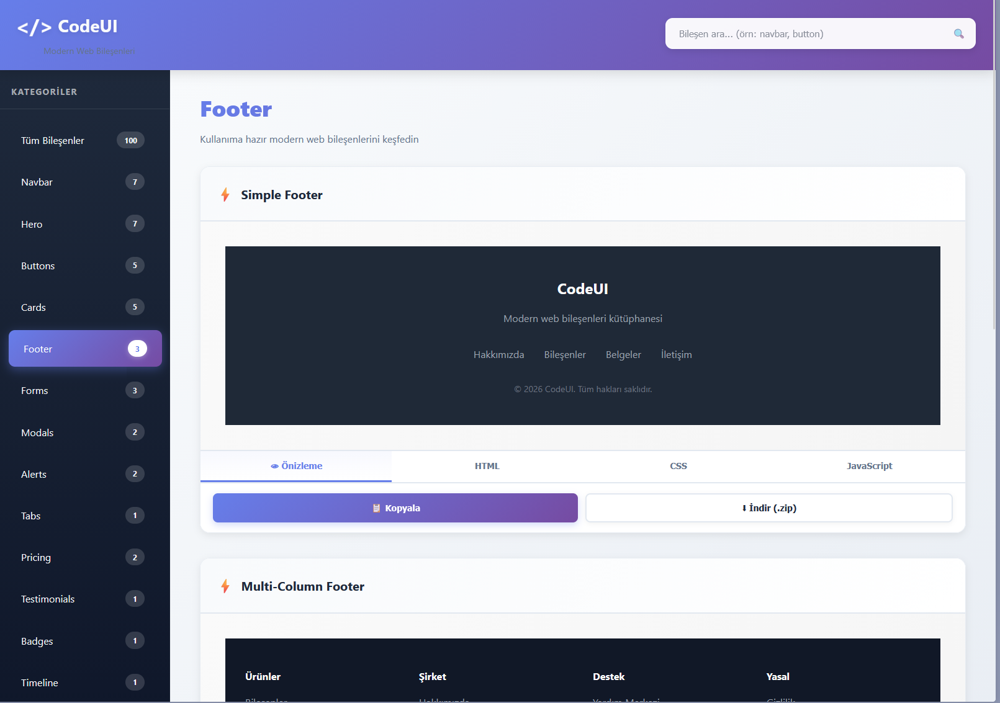
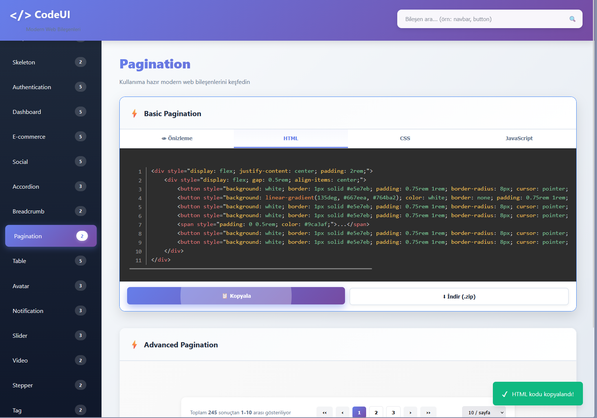
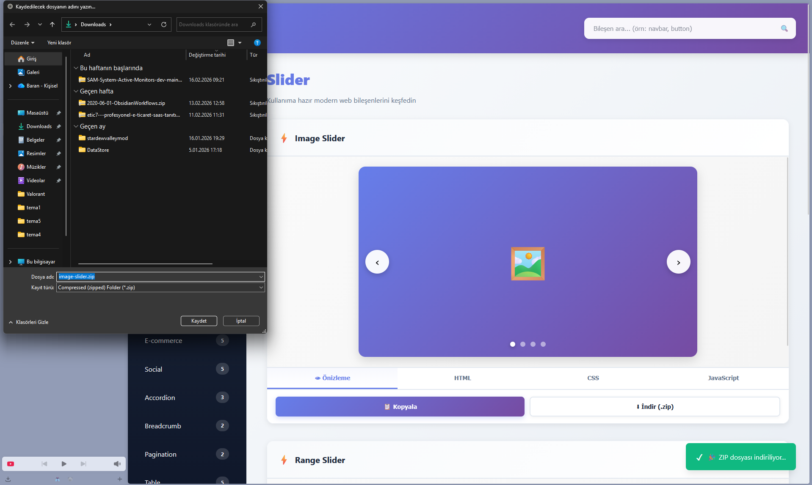

# 🎨 CodeUI - Modern UI Component Library

<div align="center">


**A comprehensive, ready-to-use UI component library with 100+ modern web components**

[🌐 Live Demo](#) | [📖 Documentation](#) | [🚀 Getting Started](#getting-started) | [🇹🇷 Türkçe](#tr-readme)

[](https://github.com/Barand1500/BW-Templates)
[](https://github.com/Barand1500/BW-Templates)
[](LICENSE)
[](https://github.com/Barand1500/BW-Templates/releases)

</div>

---

## ✨ Features

- 🎯 **49+ Ready-to-Use Components** - Production-ready components for modern web applications
- 📁 **14 Organized Categories** - Easy navigation through Navbar, Hero, Cards, Forms, and more
- 🎨 **Modern Design** - Beautiful gradients, smooth animations, and contemporary styling
- 💻 **Syntax Highlighting** - Integrated Prism.js with Tomorrow Night theme
- 📦 **One-Click ZIP Download** - Download complete component code with HTML, CSS, and JS
- 🔍 **Live Search** - Instantly find components with real-time search
- 📋 **Copy to Clipboard** - Quick copy functionality for code snippets
- 🌐 **Pure Vanilla JavaScript** - No frameworks required, just HTML, CSS, and JS
- 📱 **Fully Responsive** - Works seamlessly on all devices
- 🎭 **Multiple Variants** - Each category includes multiple design variations

---

## 🚀 Getting Started

### Quick Start

1. **Clone the repository**
   ```bash
   git clone https://github.com/Barand1500/BW-Templates.git
   cd BW-Templates
   ```

2. **Open in browser**
   ```bash
   # Simply open index.html in your browser
   open index.html  # macOS
   start index.html # Windows
   xdg-open index.html # Linux
   ```

3. **Start exploring!**
   - Browse components by category
   - Preview live demos
   - Copy code or download as ZIP
   - Integrate into your projects

### Using Components

Each component includes three code files:

```html
<!-- HTML Structure -->
<div class="component">
  <!-- Component markup -->
</div>
```

```css
/* Component Styles */
.component {
  /* Component styling */
}
```

```javascript
// Component Functionality
function initComponent() {
  // Component logic
}
```

---

## 📦 Component Categories

<table>
<tr>
<td width="50%">

### 🎯 Navigation & Layout
- **Navbar** (7 variants)
  - Transparent Navbar
  - Gradient Navbar
  - Dropdown Menu Navbar
  - Sidebar Toggle Navbar
  - Search Navbar
  - Mega Menu Navbar
  - Sticky Navbar

- **Hero** (7 variants)
  - Gradient Hero
  - Image Hero
  - Video Background Hero
  - Animated Hero
  - App Landing Hero
  - CTA Hero
  - Split Hero

- **Footer** (3 variants)
  - Simple Footer
  - Multi-Column Footer
  - Newsletter Footer

- **Breadcrumb** (2 variants)
  - Simple Breadcrumb
  - Icon Breadcrumb

</td>
<td width="50%">

### 🎨 UI Elements
- **Buttons** (5 variants)
  - Basic Buttons
  - Icon Buttons
  - Gradient Buttons
  - Loading Buttons
  - Social Media Buttons

- **Cards** (5 variants)
  - Product Card
  - Profile Card
  - Stats Card
  - Blog Card
  - Feature Card

- **Badges** (1 variant)
  - Status Badges

- **Avatar** (3 variants)
  - Avatar Group
  - Avatar with Status
  - Avatar Sizes

- **Tag** (2 variants)
  - Tag Component
  - Removable Tags

</td>
</tr>
<tr>
<td width="50%">

### 📝 Forms & Inputs
- **Forms** (3 variants)
  - Contact Form
  - Login Form
  - Multi-Step Form

- **Inputs** (5 variants)
  - Modern Input Fields
  - Search Inputs
  - File Upload
  - Select Dropdown
  - Checkbox & Radio

- **Authentication** (5 variants)
  - Login Form
  - Register Form
  - Password Reset
  - Two-Factor Authentication
  - Social Login

</td>
<td width="50%">

### 💬 Interactive Components
- **Modals** (2 variants)
  - Basic Modal
  - Confirmation Modal

- **Alerts** (2 variants)
  - Success Alert
  - Warning Alert

- **Dropdown** (2 variants)
  - User Profile Dropdown
  - Action Menu Dropdown

- **Accordion** (3 variants)
  - Basic Accordion
  - FAQ Accordion
  - Nested Accordion

- **Slider** (3 variants)
  - Image Slider
  - Range Slider
  - Content Slider

</td>
</tr>
<tr>
<td width="50%">

### 📊 Data Display
- **Tabs** (1 variant)
  - Interactive Tabs

- **Timeline** (1 variant)
  - Vertical Timeline

- **Progress** (1 variant)
  - Progress Bars

- **Pricing** (2 variants)
  - Pricing Cards
  - Toggle Pricing

- **Table** (5 variants)
  - Data Table
  - Pricing Table
  - Sortable Table
  - Responsive Table
  - Striped Table

- **Dashboard** (5 variants)
  - Analytics Dashboard
  - Recent Activity Widget
  - Quick Actions Panel
  - User Statistics
  - Sales Chart Widget

- **Stepper** (2 variants)
  - Horizontal Stepper
  - Vertical Stepper

- **Pagination** (2 variants)
  - Basic Pagination
  - Advanced Pagination

</td>
<td width="50%">

### 🎭 Media & Effects
- **Gallery** (3 variants)
  - Grid Gallery
  - Masonry Gallery
  - Carousel Gallery

- **Testimonials** (1 variant)
  - Customer Testimonials

- **Skeleton** (2 variants)
  - Card Skeleton Loader
  - List Skeleton Loader

- **Video** (2 variants)
  - Video Player
  - Video Card

- **Notification** (3 variants)
  - Toast Notification
  - Notification Badge
  - Notification Center

</td>
</tr>
<tr>
<td width="50%">

### 🛍️ E-commerce
- **E-commerce** (5 variants)
  - Product Grid
  - Shopping Cart
  - Checkout Form
  - Product Detail
  - Wishlist

</td>
<td width="50%">

### 👥 Social
- **Social** (5 variants)
  - Social Post Card
  - Comment Section
  - User Profile Card
  - Follow Button
  - User List

</td>
</tr>
</table>

---

## 🛠️ Tech Stack

<table>
<tr>
<td align="center" width="150">

<br>HTML5
</td>
<td align="center" width="150">

<br>CSS3
</td>
<td align="center" width="150">

<br>JavaScript
</td>
<td align="center" width="150">

<br>Prism.js
</td>
</tr>
</table>

**Libraries & Tools:**
- **Prism.js v1.29.0** - Syntax highlighting with Tomorrow Night theme
- **JSZip v3.10.1** - ZIP file generation for downloads
- **FileSaver.js v2.0.5** - Client-side file downloads
- **CSS Grid & Flexbox** - Modern responsive layouts
- **Custom Animations** - Smooth transitions and effects

---

## 📸 Screenshots

<div align="center">

### Homepage


### Component Preview


### Search & Filter


</div>

---

## 💡 Usage Examples

### Example 1: Adding a Gradient Button

```html
<!-- HTML -->
<button class="gradient-btn">Click Me</button>
```

```css
/* CSS */
.gradient-btn {
    background: linear-gradient(135deg, #667eea, #764ba2);
    color: white;
    padding: 1rem 2rem;
    border: none;
    border-radius: 12px;
    cursor: pointer;
    font-weight: 600;
    box-shadow: 0 4px 15px rgba(102, 126, 234, 0.4);
    transition: transform 0.3s;
}

.gradient-btn:hover {
    transform: translateY(-2px);
}
```

### Example 2: Using a Modal

```javascript
// JavaScript
function openModal(modalId) {
    document.getElementById(modalId).style.display = 'flex';
}

function closeModal(modalId) {
    document.getElementById(modalId).style.display = 'none';
}
```

---

## 🎯 Roadmap

- [x] Core component library (49 components)
- [x] Syntax highlighting integration
- [x] ZIP download functionality
- [x] Live search feature
- [ ] Reach 100+ components
- [ ] Dark mode support
- [ ] Component customization tools
- [ ] React/Vue/Angular versions
- [ ] Accessibility improvements
- [ ] More animation options

---

## 🤝 Contributing

Contributions are welcome! Feel free to:

1. Fork the repository
2. Create your feature branch (`git checkout -b feature/AmazingFeature`)
3. Commit your changes (`git commit -m 'Add some AmazingFeature'`)
4. Push to the branch (`git push origin feature/AmazingFeature`)
5. Open a Pull Request

---

## 📄 License

This project is licensed under the MIT License - see the [LICENSE](LICENSE) file for details.

---

## 🙏 Acknowledgments

- Prism.js for excellent syntax highlighting
- JSZip for seamless ZIP generation
- FileSaver.js for client-side downloads
- The web development community for inspiration

---

## 📞 Contact

**Project Link:** [https://github.com/Barand1500/BW-Templates](https://github.com/Barand1500/BW-Templates)

---

<div align="center">

### ⭐ Star this repository if you find it helpful!

Made with ❤️ by developers, for developers

</div>

---
---
---

<a name="tr-readme"></a>

# 🎨 CodeUI - Modern UI Bileşen Kütüphanesi

<div align="center">


**49+ modern web bileşeni içeren kapsamlı, kullanıma hazır UI kütüphanesi**

[🌐 Canlı Demo](#) | [📖 Dokümantasyon](#) | [🚀 Başlangıç](#baslangic) | [🇬🇧 English](#)

[](https://github.com/Barand1500/BW-Templates)
[](https://github.com/Barand1500/BW-Templates)
[](LICENSE)
[](https://github.com/Barand1500/BW-Templates/releases)

</div>

---

## ✨ Özellikler

- 🎯 **49+ Kullanıma Hazır Bileşen** - Modern web uygulamaları için production-ready bileşenler
- 📁 **14 Organize Kategori** - Navbar, Hero, Kartlar, Formlar ve daha fazlası ile kolay gezinme
- 🎨 **Modern Tasarım** - Güzel gradyanlar, akıcı animasyonlar ve çağdaş stil
- 💻 **Söz Dizimi Vurgulama** - Tomorrow Night teması ile entegre Prism.js
- 📦 **Tek Tıkla ZIP İndirme** - HTML, CSS ve JS ile tam bileşen kodunu indirin
- 🔍 **Canlı Arama** - Gerçek zamanlı arama ile bileşenleri anında bulun
- 📋 **Panoya Kopyala** - Kod parçacıkları için hızlı kopyalama özelliği
- 🌐 **Saf Vanilla JavaScript** - Framework gerekmez, sadece HTML, CSS ve JS
- 📱 **Tamamen Responsive** - Tüm cihazlarda sorunsuz çalışır
- 🎭 **Çoklu Varyantlar** - Her kategori birden fazla tasarım çeşidi içerir

---

## 🚀 Başlangıç {#baslangic}

### Hızlı Başlangıç

1. **Repository'yi klonlayın**
   ```bash
   git clone https://github.com/Barand1500/BW-Templates.git
   cd BW-Templates
   ```

2. **Tarayıcıda açın**
   ```bash
   # index.html dosyasını tarayıcınızda açın
   open index.html  # macOS
   start index.html # Windows
   xdg-open index.html # Linux
   ```

3. **Keşfetmeye başlayın!**
   - Kategorilere göre bileşenlere göz atın
   - Canlı demoları inceleyin
   - Kodu kopyalayın veya ZIP olarak indirin
   - Projelerinize entegre edin

### Bileşenleri Kullanma

Her bileşen üç kod dosyası içerir:

```html
<!-- HTML Yapısı -->
<div class="component">
  <!-- Bileşen işaretlemesi -->
</div>
```

```css
/* Bileşen Stilleri */
.component {
  /* Bileşen stil özellikleri */
}
```

```javascript
// Bileşen Fonksiyonelliği
function initComponent() {
  // Bileşen mantığı
}
```

---

## 📦 Bileşen Kategorileri

<table>
<tr>
<td width="50%">

### 🎯 Navigasyon & Düzen
- **Navbar** (7 varyant)
  - Şeffaf Navbar
  - Gradient Navbar
  - Dropdown Menülü Navbar
  - Sidebar Toggle Navbar
  - Arama Navbar
  - Mega Menü Navbar
  - Sabit Navbar

- **Hero** (7 varyant)
  - Gradient Hero
  - Görsel Hero
  - Video Arka Planlı Hero
  - Animasyonlu Hero
  - Uygulama Açılış Hero
  - CTA Hero
  - Bölünmüş Hero

- **Footer** (3 varyant)
  - Basit Footer
  - Çok Kolonlu Footer
  - Bültenli Footer

- **Breadcrumb** (2 varyant)
  - Basit Breadcrumb
  - İkonlu Breadcrumb

</td>
<td width="50%">

### 🎨 UI Elemanları
- **Buttons** (5 varyant)
  - Temel Butonlar
  - İkonlu Butonlar
  - Gradient Butonlar
  - Yükleniyor Butonları
  - Sosyal Medya Butonları

- **Cards** (5 varyant)
  - Ürün Kartı
  - Profil Kartı
  - İstatistik Kartı
  - Blog Kartı
  - Özellik Kartı

- **Badges** (1 varyant)
  - Durum Rozetleri

- **Avatar** (3 varyant)
  - Avatar Grubu
  - Durum Göstergeli Avatar
  - Avatar Boyutları

- **Tag** (2 varyant)
  - Etiket Bileşeni
  - Kaldırılabilir Etiketler

</td>
</tr>
<tr>
<td width="50%">

### 📝 Formlar & Girdiler
- **Forms** (3 varyant)
  - İletişim Formu
  - Giriş Formu
  - Çok Adımlı Form

- **Inputs** (5 varyant)
  - Modern Giriş Alanları
  - Arama Girdileri
  - Dosya Yükleme
  - Seçim Açılır Menüsü
  - Checkbox & Radio

- **Authentication** (5 varyant)
  - Giriş Formu
  - Kayıt Formu
  - Şifre Sıfırlama
  - İki Faktörlü Doğrulama
  - Sosyal Giriş

</td>
<td width="50%">

### 💬 İnteraktif Bileşenler
- **Modals** (2 varyant)
  - Temel Modal
  - Onay Modal'ı

- **Alerts** (2 varyant)
  - Başarılı Uyarı
  - Dikkat Uyarısı

- **Dropdown** (2 varyant)
  - Kullanıcı Profili Dropdown
  - Aksiyon Menüsü Dropdown

- **Accordion** (3 varyant)
  - Basit Accordion
  - SSS Accordion
  - İç İçe Accordion

- **Slider** (3 varyant)
  - Görsel Slider
  - Aralık Slider
  - İçerik Slider

</td>
</tr>
<tr>
<td width="50%">

### 📊 Veri Gösterimi
- **Tabs** (1 varyant)
  - İnteraktif Sekmeler

- **Timeline** (1 varyant)
  - Dikey Zaman Çizelgesi

- **Progress** (1 varyant)
  - İlerleme Çubukları

- **Pricing** (2 varyant)
  - Fiyatlandırma Kartları
  - Geçişli Fiyatlandırma

- **Table** (5 varyant)
  - Veri Tablosu
  - Fiyatlandırma Tablosu
  - Sıralanabilir Tablo
  - Duyarlı Tablo
  - Çizgili Tablo

- **Dashboard** (5 varyant)
  - Analitik Panosu
  - Son Aktivite Widget'ı
  - Hızlı İşlem Paneli
  - Kullanıcı İstatistikleri
  - Satış Grafiği Widget'ı

- **Stepper** (2 varyant)
  - Yatay Adımlayıcı
  - Dikey Adımlayıcı

- **Pagination** (2 varyant)
  - Basit Sayfalama
  - Gelişmiş Sayfalama

</td>
<td width="50%">

### 🎭 Medya & Efektler
- **Gallery** (3 varyant)
  - Grid Galeri
  - Masonry Galeri
  - Carousel Galeri

- **Testimonials** (1 varyant)
  - Müşteri Yorumları

- **Skeleton** (2 varyant)
  - Kart Skeleton Yükleyici
  - Liste Skeleton Yükleyici

- **Video** (2 varyant)
  - Video Oynatıcı
  - Video Kartı

- **Notification** (3 varyant)
  - Toast Bildirimi
  - Bildirim Rozeti
  - Bildirim Merkezi

</td>
</tr>
<tr>
<td width="50%">

### 🛍️ E-ticaret
- **E-commerce** (5 varyant)
  - Ürün Izgara
  - Alışveriş Sepeti
  - Ödeme Formu
  - Ürün Detayı
  - İstek Listesi

</td>
<td width="50%">

### 👥 Sosyal
- **Social** (5 varyant)
  - Sosyal Gönderi Kartı
  - Yorum Bölümü
  - Kullanıcı Profil Kartı
  - Takip Butonu
  - Kullanıcı Listesi

</td>
</tr>
</table>

---

## 🛠️ Teknoloji Yığını

<table>
<tr>
<td align="center" width="150">

<br>HTML5
</td>
<td align="center" width="150">

<br>CSS3
</td>
<td align="center" width="150">

<br>JavaScript
</td>
<td align="center" width="150">

<br>Prism.js
</td>
</tr>
</table>

**Kütüphaneler & Araçlar:**
- **Prism.js v1.29.0** - Tomorrow Night teması ile söz dizimi vurgulama
- **JSZip v3.10.1** - İndirmeler için ZIP dosyası oluşturma
- **FileSaver.js v2.0.5** - İstemci tarafı dosya indirme
- **CSS Grid & Flexbox** - Modern responsive düzenler
- **Özel Animasyonlar** - Akıcı geçişler ve efektler

---

## 📸 Ekran Görüntüleri

<div align="center">

### Ana Sayfa


### Bileşen Önizleme


### Arama & Filtreleme


</div>

---

## 💡 Kullanım Örnekleri

### Örnek 1: Gradient Buton Ekleme

```html
<!-- HTML -->
<button class="gradient-btn">Tıkla</button>
```

```css
/* CSS */
.gradient-btn {
    background: linear-gradient(135deg, #667eea, #764ba2);
    color: white;
    padding: 1rem 2rem;
    border: none;
    border-radius: 12px;
    cursor: pointer;
    font-weight: 600;
    box-shadow: 0 4px 15px rgba(102, 126, 234, 0.4);
    transition: transform 0.3s;
}

.gradient-btn:hover {
    transform: translateY(-2px);
}
```

### Örnek 2: Modal Kullanımı

```javascript
// JavaScript
function openModal(modalId) {
    document.getElementById(modalId).style.display = 'flex';
}

function closeModal(modalId) {
    document.getElementById(modalId).style.display = 'none';
}
```

---

## 🎯 Yol Haritası

- [x] Temel bileşen kütüphanesi (49 bileşen)
- [x] Söz dizimi vurgulama entegrasyonu
- [x] ZIP indirme özelliği
- [x] Canlı arama özelliği
- [ ] 100+ bileşene ulaşma
- [ ] Karanlık mod desteği
- [ ] Bileşen özelleştirme araçları
- [ ] React/Vue/Angular versiyonları
- [ ] Erişilebilirlik iyileştirmeleri
- [ ] Daha fazla animasyon seçeneği

---

## 🤝 Katkıda Bulunma

Katkılarınızı bekliyoruz! Şunları yapabilirsiniz:

1. Repository'yi fork edin
2. Feature branch'inizi oluşturun (`git checkout -b feature/HarikaOzellik`)
3. Değişikliklerinizi commit edin (`git commit -m 'Harika özellik eklendi'`)
4. Branch'inizi push edin (`git push origin feature/HarikaOzellik`)
5. Pull Request açın

---

## 📄 Lisans

Bu proje MIT Lisansı altında lisanslanmıştır - detaylar için [LICENSE](LICENSE) dosyasına bakın.

---

## 🙏 Teşekkürler

- Mükemmel söz dizimi vurgulama için Prism.js'e
- Sorunsuz ZIP oluşturma için JSZip'e
- İstemci tarafı indirmeler için FileSaver.js'e
- İlham için web geliştirme topluluğuna

---

## 📞 İletişim

**Proje Linki:** [https://github.com/Barand1500/BW-Templates](https://github.com/Barand1500/BW-Templates)

---

<div align="center">

### ⭐ Faydalı bulduysanız bu repository'ye yıldız vermeyi unutmayın!

Geliştiriciler tarafından, geliştiriciler için ❤️ ile yapıldı

</div>
